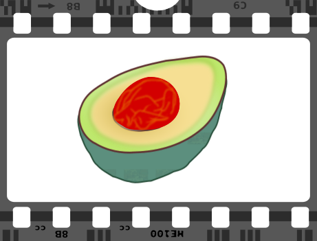
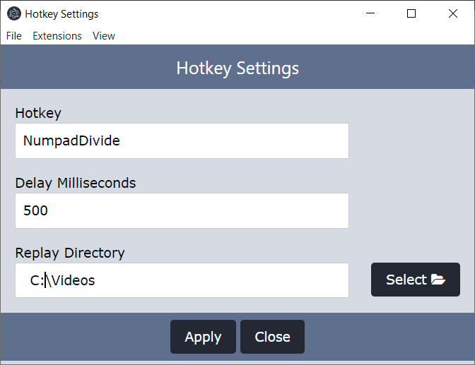

# avocapture

An extensible application to rename replays as they are captured.

## Overview

This application was created to more easily capture bugs without having to rewatch generically named
replay files and rename them.

## Usage

1. Select a Replay Detection Method
  1. Configure the settings for it

2. Optionally select a replay upload method
3. Run the desired capture game in non Fullscreen mode

When a replay is detected, a dialog will show up to allow you to rename that replay:

## Other

- Additional [documentation](./docs/README.md)
