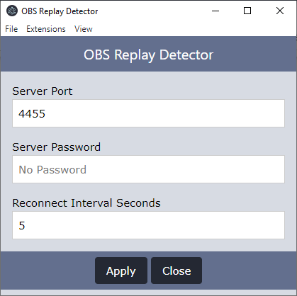

# avocapture-obs-detector

This is a `detector` which moves uses [OBS Websocket Events](https://github.com/obs-websocket-community-projects/obs-websocket-js) to determine when a replay has been created.

## Intended Usage

The designed usage of this extension was to rely on OBS to tell the application when a replay was made and where to find it, instead of relying on an arbitrary delay before searching for a replay.

## Required Software

* The [OBS WebSocket Server](https://github.com/obsproject/obs-websocket/releases) needs to be installed.

## Settings

* **Server Port**: port for the server
* **Server Password**: password for the server, if the server has no password, leave this blank
* **Reconnect Interval Seconds**: how many seconds to wait before attempting to reconnect, in case OBS was not started prior to the application or if connection was lost to the server.

