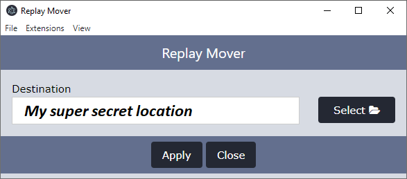

# avocapture-replay-mover

This is an `uploader` which moves the renamed replays to a desired location.

## Intended Usage

The designed usage of this extension was to place all replays in a handy location, regardless of how that replay was captured.

## Settings

* **Destination**: Directory where replays should be moved to

