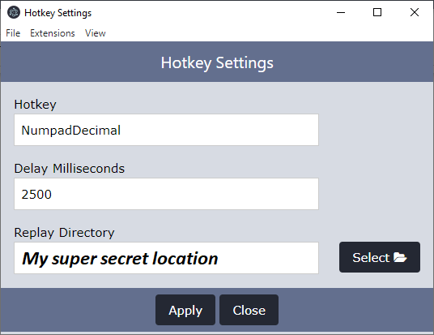

# avocapture-search-on-hotkey

This is a `detector` extension which searches a defined folder for the latest replay file, when a hotkey is pressed.

## Intended Usage

The designed usage of this extension was to support replay capturing software that didn't have an event, so it is designed
with having a delay before the replay is saved and available to be found.

This can be used in combination with OBS by setting up a replay buffer hotkey to the same hotkey and a sufficiently long delay before searching for replays.

## Settings

* **Hotkey**: the keybind to use to activate the search
* **Delay Milliseconds**: how many seconds to wait before searching for a replay
* **Replay Directory**: directory that should be searched for to find a new replay

