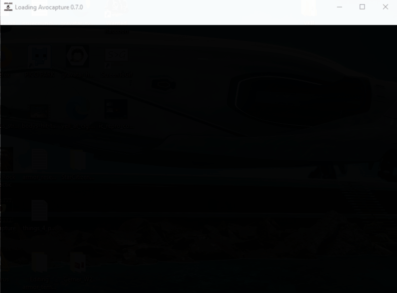

# Usage Guide

--- 
:warning: :warning: :warning: 

## Non Full Screen

In order to properly show the dialog, the game you're attempting to capture should be ran in borderless/windowed mode at the moment.

## Executable Disclaimer

* I am aware of how suspicious it is to ask you to download an executable and trust me, I have signed the binary produced by this project with a Code Siging License. As people download and use the software, windows will eventually mark it as trusted.

* If you do not trust the executable, you can build the project from sources using `npm` and `electron-forge`.
---

## Setup

1. Download the latest available `avocapture-setup.exe` from the [Github Releases](https://github.com/AnEmortalKid/avocapture/releases)
2. Open the executable, you'll see a loading screen as the app is installing for the first time to the system. 
3. A secondary loading screen will show up when extensions are installed/updated and on each launch (should be much faster after extensions are installed once).
4. Once application loads, you should be able to pick which mechanism to detect your replays and update the settings based on the extension's you're using:

## Extension Setup

1. Select a Replay Detection Method
  1. Configure the settings for it (see the [extension's documentation](./extensions/README.md) for more info)

2. _Optionally_ select a replay upload method
3. Run the desired capture game in non Fullscreen mode

When a replay is detected, a dialog will show up to allow you to rename that replay:

